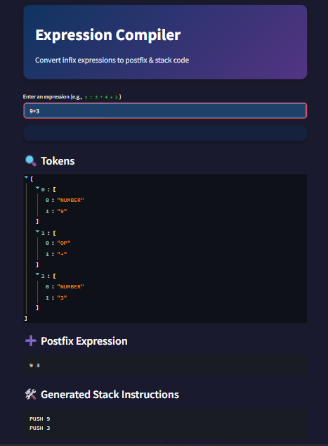

```markdown


````
# 🚀 Infix Expression Compiler with AST Visualization

    
    **This** is a comprehensive expression compiler that transforms infix mathematical expressions into multiple representations including 
    postfix notation, stack-based instructions, and visual Abstract Syntax Trees (AST).It showcases essential compiler components like lexing,
    parsing, AST generation, and code generation — all through an elegant web interface built using **Streamlit**.

---

> 🔍 Perfect for learning compiler design, expression parsing, AST visualization, and stack-based evaluation.


````
## 📁 Project Structure
├── app.py                
├── lexer.py              
├── infix\_to\_postfix.py 
├── ast\_builder.py       
├── codegen.py            
├── requirements.txt      

````

## 🚀 Features

- ✨ **Lexical Analysis** – Tokenize arithmetic expressions into meaningful components  
- ✨ **Supports basic arithmetic**: `+ - * / ^` with proper operator precedence  
- ✨ **Infix to Postfix Parsing** – Shunting Yard algorithm implementation  
- ✨ **Handles parentheses and variable names** for complex expressions  
- ✨ **AST Generation** – Build and visualize Abstract Syntax Trees[^1]  
- ✨ **Code Generation** – Stack-machine-like pseudo instructions (`PUSH`, `ADD`, etc.)  
- ✨ **Multiple Output Formats** – Tokens, Postfix notation, Stack instructions, and AST structure  

---

## ✅ Requirements

- Python 3.8+
- [`streamlit`](https://streamlit.io/)

---

## 📦 Installation

Install the required packages using:

```bash
pip install -r requirements.txt
````

---

## 🧪 How to Run the App

1. Clone or download this repository
2. Open your terminal and run:

```bash
streamlit run app.py
```

3. Open your browser to:

```
http://localhost:8501
```

---

## ⚙️ Usage

Enter any arithmetic expression like:

```
(a + b) * (c - 42)
```

The app will return:

### 🔖 Tokens

```json
["(", "a", "+", "b", ")", "*", "(", "c", "-", "42", ")"]
```

### 🔁 Postfix Expression

```
a b + c 42 - *
```

### 🧾 Stack Machine Instructions

```
PUSH a
PUSH b
+
PUSH c
PUSH 42
-
*
```

### 🌳 AST Structure

The compiler generates a visual Abstract Syntax Tree representation showing the hierarchical structure of your expression[^1]. The AST for `(a + b) * (c - 42)` displays:

* Root: `*` (multiplication operator)
* Left subtree: `+` with operands `a` and `b`
* Right subtree: `-` with operands `c` and `42`

```json
{
  "value": "*",
  "left": {
    "value": "+",
    "left": {"value": "a", "left": null, "right": null},
    "right": {"value": "b", "left": null, "right": null}
  },
  "right": {
    "value": "-",
    "left": {"value": "c", "left": null, "right": null},
    "right": {"value": "42", "left": null, "right": null}
  }
}
```

---

## 🌐 Deployment Tips

To access the app from other devices on your local network (e.g., mobile):

```bash
streamlit run app.py --server.address 0.0.0.0 --server.port 8501
```

Then access it using:

```
http://<your-ip>:8501
```

---

## 💻 Core Implementation

```python
st.title("Infix Expression Compiler")
st.write("Enter an arithmetic expression (e.g., (a + b) * c):")

expression = st.text_input("Expression")

if expression:
    try:
        tokens = lex(expression)
        token_values = [t[1] for t in tokens if t[0] != 'SKIP']
        postfix = infix_to_postfix([(t[0], t[1]) for t in tokens if t[0] != 'SKIP'])
        instructions = generate_code(postfix.split())
        ast = build_ast(tokens)
        
        st.subheader("Tokens")
        st.json(token_values)
        
        st.subheader("Postfix Expression")
        st.code(postfix)
        
        st.subheader("Stack Machine Instructions")
        st.code('\n'.join(instructions))
        
        st.subheader("AST Visualization")
        st.json(ast)
        
    except Exception as e:
        st.error(f"Error: {e}")
```

---

## 🔗 Live Demo

**Access the live application:**

* **Streamlit Cloud**: [https://mini-x-compiler.streamlit.app/](https://mini-x-compiler.streamlit.app/)
* **Hugging Face Spaces**: [https://huggingface.co/spaces/Safwanahmad619/infix-to-post-compiler/](https://huggingface.co/spaces/Safwanahmad619/infix-to-post-compiler/)

---

### 🖼️ Screenshot

<div align="center">
  
</div>
<div style="text-align: center"></div>
